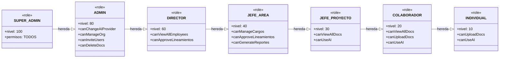
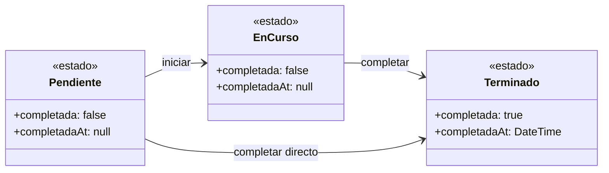
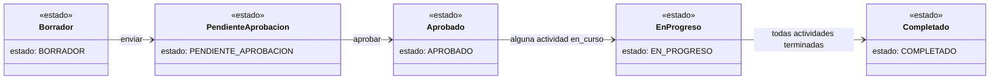
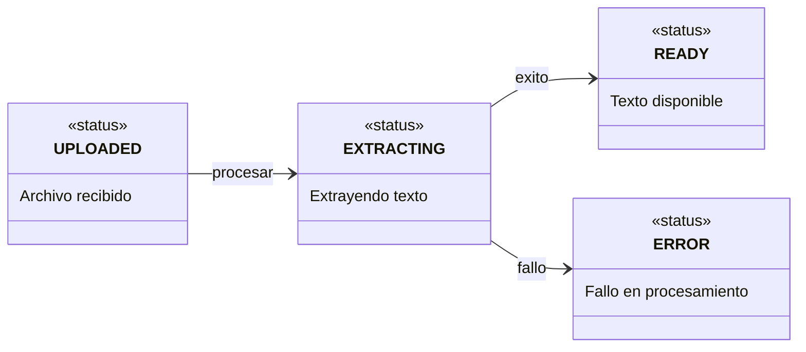

# Diagrama de Clases - Incorporated

Diagrama de clases Mermaid que muestra todos los modelos de datos (Prisma), interfaces TypeScript, proveedores de IA y modulos de seguridad del sistema Incorporated.

---

## Diagrama Completo del Sistema

```mermaid
classDiagram
    direction TB

    %% ============================================================
    %% ENUMS
    %% ============================================================
    class AppMode {
        <<enumeration>>
        enterprise
        individual
    }

    class AIProviderEnum {
        <<enumeration>>
        gemini
        ollama
        none
    }

    class Role {
        <<enumeration>>
        SUPER_ADMIN
        ADMIN
        DIRECTOR
        JEFE_AREA
        JEFE_PROYECTO
        COLABORADOR
        INDIVIDUAL
    }

    class ObjetivoTipo {
        <<enumeration>>
        ESTRATEGICO
        OPERATIVO
    }

    class ObjetivoEstado {
        <<enumeration>>
        BORRADOR
        PENDIENTE_APROBACION
        APROBADO
        EN_PROGRESO
        COMPLETADO
    }

    class DocumentType {
        <<enumeration>>
        PEI
        FODA
        MOF
        POI
        OTRO
    }

    class DocumentFormat {
        <<enumeration>>
        PDF
        DOCX
        DOC
        XLSX
        XLS
        TXT
        MD
        TEXT
    }

    class DocumentStatus {
        <<enumeration>>
        UPLOADED
        EXTRACTING
        CHUNKING
        EMBEDDING
        READY
        ERROR
    }

    %% ============================================================
    %% PRISMA MODELS - AUTH & USERS
    %% ============================================================
    class Organization {
        +String id
        +String name
        +AppMode mode
        +AIProviderEnum aiProvider
        +DateTime createdAt
        +DateTime updatedAt
        +User[] users
        +Area[] areas
        +Document[] documents
        +Cargo[] cargos
    }

    class User {
        +String id
        +String email
        +String? name
        +String? passwordHash
        +Role role
        +Boolean isActive
        +String? twoFactorSecret
        +Boolean twoFactorEnabled
        +DateTime createdAt
        +DateTime updatedAt
        +String? organizationId
        +String? cargoId
        +Document[] uploadedDocs
        +Objetivo[] objetivos
        +OnboardingChecklist[] checklists
        +ChatSession[] chatSessions
    }

    %% ============================================================
    %% PRISMA MODELS - ORGANIZATIONAL STRUCTURE
    %% ============================================================
    class Area {
        +String id
        +String name
        +String? description
        +DateTime createdAt
        +String organizationId
        +String? parentId
        +String? directorId
        +Cargo[] cargos
        +Area[] children
        +Area? parent
    }

    class Cargo {
        +String id
        +String name
        +String? description
        +String[] competencias
        +String? reportsTo
        +DateTime createdAt
        +String organizationId
        +String? areaId
        +User[] users
        +Objetivo[] objetivos
        +OnboardingChecklist[] checklists
    }

    %% ============================================================
    %% PRISMA MODELS - OBJECTIVES, OKRs, KPIs
    %% ============================================================
    class Objetivo {
        +String id
        +String titulo
        +String descripcion
        +ObjetivoTipo tipo
        +String? alineamientoPei
        +ObjetivoEstado estado
        +String? periodo
        +String? gestion
        +Boolean generadoPorIA
        +DateTime createdAt
        +DateTime updatedAt
        +String cargoId
        +String? userId
        +KPI[] kpis
        +Actividad[] actividades
        +OKR[] okrs
    }

    class KPI {
        +String id
        +String nombre
        +String metrica
        +String meta
        +String? valorActual
        +String frecuencia
        +DateTime createdAt
        +String objetivoId
    }

    class OKR {
        +String id
        +String objective
        +Json keyResults
        +Float progress
        +String periodo
        +DateTime createdAt
        +DateTime updatedAt
        +String objetivoId
    }

    class Actividad {
        +String id
        +String descripcion
        +String plazoDias
        +String prioridad
        +String estado
        +Boolean completada
        +DateTime? completadaAt
        +DateTime createdAt
        +String objetivoId
    }

    %% ============================================================
    %% PRISMA MODELS - DOCUMENTS & RAG
    %% ============================================================
    class Document {
        +String id
        +String name
        +DocumentType type
        +DocumentFormat format
        +String? url
        +String? rawText
        +DocumentStatus status
        +Int chunksCount
        +String? errorMessage
        +DateTime createdAt
        +String organizationId
        +String uploadedById
        +DocumentChunk[] chunks
    }

    class DocumentChunk {
        +String id
        +String content
        +String? embedding
        +Int chunkIndex
        +Json? metadata
        +DateTime createdAt
        +String documentId
    }

    %% ============================================================
    %% PRISMA MODELS - ONBOARDING
    %% ============================================================
    class OnboardingChecklist {
        +String id
        +Json items
        +Float progress
        +DateTime createdAt
        +DateTime updatedAt
        +String userId
        +String cargoId
    }

    %% ============================================================
    %% PRISMA MODELS - CHAT / AI SESSIONS
    %% ============================================================
    class ChatSession {
        +String id
        +String? title
        +DateTime createdAt
        +DateTime updatedAt
        +String userId
        +ChatMessage[] messages
    }

    class ChatMessage {
        +String id
        +String role
        +String content
        +Json? sources
        +DateTime createdAt
        +String sessionId
    }

    %% ============================================================
    %% TypeScript INTERFACES - AI System
    %% ============================================================
    class AIProvider {
        <<interface>>
        +AIProviderName name
        +AICapabilities capabilities
        +chat(messages, context?) AsyncIterable~string~
        +embed(text) Promise~number[]~
        +embedBatch(texts) Promise~number[][]~
        +generateStructured(prompt, schema, context?) Promise~T~
        +isAvailable() Promise~boolean~
    }

    class AICapabilities {
        <<interface>>
        +boolean chat
        +boolean embeddings
        +boolean streaming
        +boolean structuredOutput
        +number maxTokens
        +number embeddingDimensions
    }

    class ChatMessageInterface {
        <<interface>>
        +string role
        +string content
    }

    class RAGContext {
        <<interface>>
        +Array chunks
        +Object? cargoInfo
    }

    %% ============================================================
    %% PROVIDER CLASSES
    %% ============================================================
    class GeminiProvider {
        +AIProviderName name = "gemini"
        +AICapabilities capabilities
        +chat(messages, context?)
        +embed(text)
        +embedBatch(texts)
        +generateStructured(prompt, schema, context?)
        +isAvailable()
    }

    class OllamaProvider {
        +AIProviderName name = "ollama"
        +AICapabilities capabilities
        +chat(messages, context?)
        +embed(text)
        +embedBatch(texts)
        +generateStructured(prompt, schema, context?)
        +isAvailable()
    }

    class NoAIProvider {
        +AIProviderName name = "none"
        +AICapabilities capabilities
        +chat(messages, context?)
        +embed(text)
        +embedBatch(texts)
        +generateStructured(prompt, schema, context?)
        +isAvailable()
    }

    class AIProviderFactory {
        <<factory>>
        +createAIProvider(providerName?) AIProvider
    }

    %% ============================================================
    %% SECURITY MODULES
    %% ============================================================
    class RoleGuard {
        <<module>>
        +hasMinRole(userRole, minRole) boolean
        +hasRole(userRole, allowedRoles) boolean
        +canManageUser(managerRole, targetRole) boolean
        +permissions Object
    }

    class RateLimiter {
        <<module>>
        +checkRateLimit(identifier, config) RateLimitResult
        +getClientIP(headers) string
        +RATE_LIMITS Object
    }

    class RateLimitConfig {
        +number maxRequests
        +number windowMs
    }

    %% ============================================================
    %% SERVICE CLASSES
    %% ============================================================
    class DocumentAnalyzer {
        <<service>>
        +analyzeDocument(text, documentName) DocumentAnalysis
        -detectSections(text) string[]
        -extractObjectives(text, source) ExtractedObjective[]
        -extractKPIs(text, source) ExtractedKPI[]
        -extractLineamientos(text, source) ExtractedLineamiento[]
        -detectPerspectives(text) string[]
        -detectDocumentType(text) string
        -generateSummary(objetivos, kpis, perspectivas, tipo) string
    }

    class DocumentAnalysis {
        +ExtractedObjective[] objetivos
        +ExtractedKPI[] kpis
        +ExtractedLineamiento[] lineamientos
        +string[] perspectivas
        +string resumen
        +Object metadata
    }

    class ExtractedObjective {
        +string titulo
        +string descripcion
        +string tipo
        +string source
        +string confidence
        +string[] actividades
    }

    class ExtractedKPI {
        +string nomenclatura
        +string nombre
        +string objetivo
        +string formula
        +Array condiciones
        +string perspectiva
        +string source
    }

    %% ============================================================
    %% RELATIONSHIPS - Database
    %% ============================================================
    Organization "1" --> "*" User : tiene
    Organization "1" --> "*" Area : tiene
    Organization "1" --> "*" Document : tiene
    Organization "1" --> "*" Cargo : tiene

    Area "1" --> "*" Cargo : contiene
    Area "0..1" --> "*" Area : parent/children

    Cargo "1" --> "*" User : asignado a
    Cargo "1" --> "*" Objetivo : define
    Cargo "1" --> "*" OnboardingChecklist : genera

    User "1" --> "*" Objetivo : posee
    User "1" --> "*" Document : sube
    User "1" --> "*" OnboardingChecklist : tiene
    User "1" --> "*" ChatSession : inicia

    Objetivo "1" --> "*" KPI : mide
    Objetivo "1" --> "*" Actividad : descompone en
    Objetivo "1" --> "*" OKR : alinea con

    Document "1" --> "*" DocumentChunk : divide en

    ChatSession "1" --> "*" ChatMessage : contiene

    %% ============================================================
    %% RELATIONSHIPS - AI System
    %% ============================================================
    AIProvider <|.. GeminiProvider : implementa
    AIProvider <|.. OllamaProvider : implementa
    AIProvider <|.. NoAIProvider : implementa
    AIProviderFactory ..> AIProvider : crea

    AIProvider --> AICapabilities : tiene
    AIProvider --> ChatMessageInterface : usa
    AIProvider --> RAGContext : recibe

    %% ============================================================
    %% RELATIONSHIPS - Services
    %% ============================================================
    DocumentAnalyzer --> DocumentAnalysis : produce
    DocumentAnalysis --> ExtractedObjective : contiene
    DocumentAnalysis --> ExtractedKPI : contiene

    RateLimiter --> RateLimitConfig : usa
```

---

## Jerarquia de Roles (RBAC)

---

## Maquina de Estados - Actividad

---

## Maquina de Estados - Objetivo

---

## Pipeline de Procesamiento de Documentos

