# Diagramas de Secuencia - Incorporated

Diagramas de secuencia Mermaid que representan los flujos principales del sistema Incorporated.

---

## 1. Registro de Usuario (Modo Enterprise e Individual)

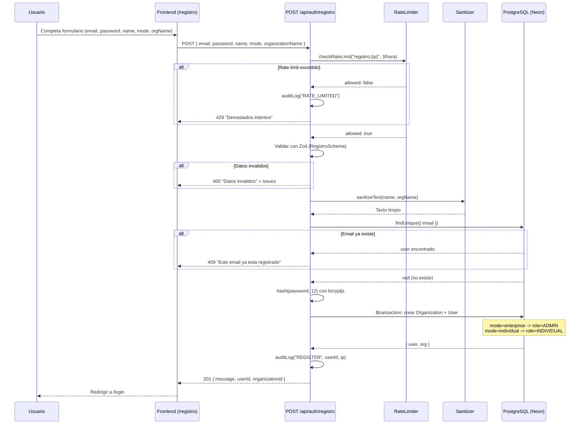

---

## 2. Login con 2FA Opcional

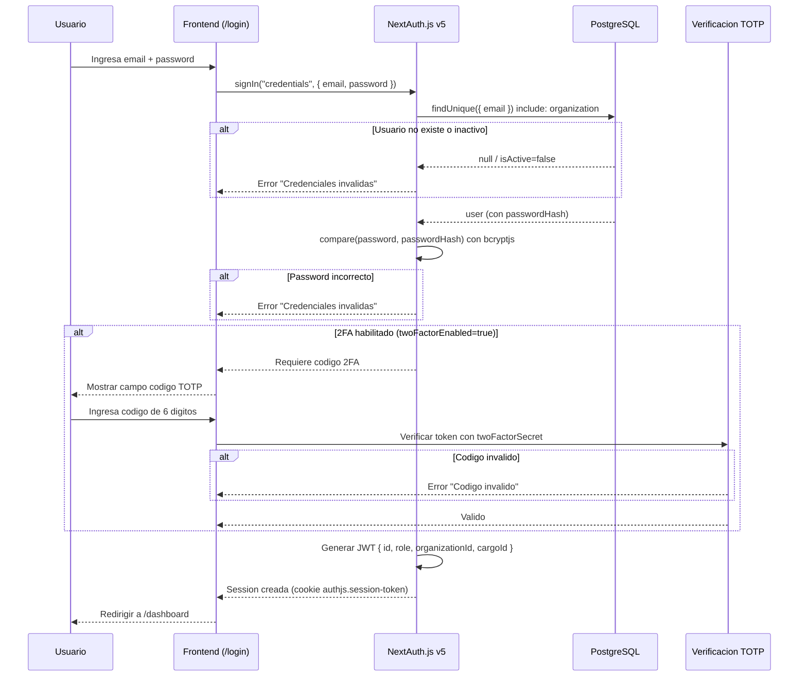

---

## 3. Subida de Documentos (Document Upload)

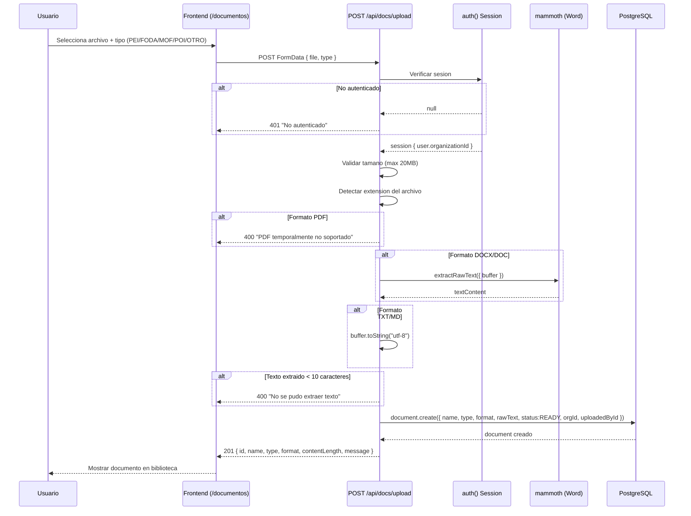

---

## 4. Analisis de Documentos (Pattern-Based sin IA)

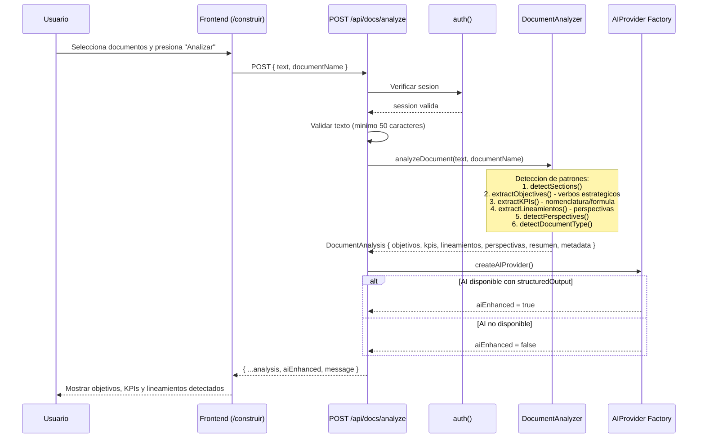

---

## 5. Generacion de Lineamientos con IA (Gemini)

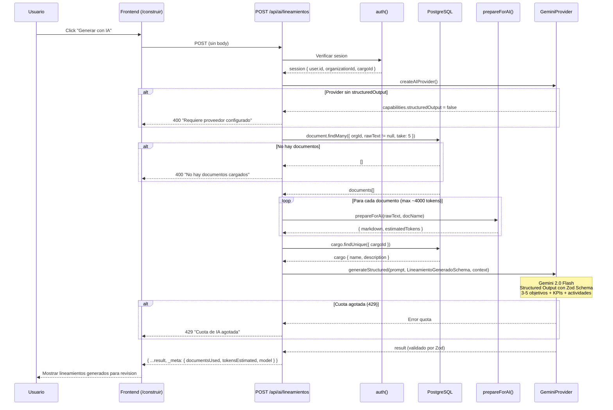

---

## 6. Asistente IA - Chat (RAG Flow)

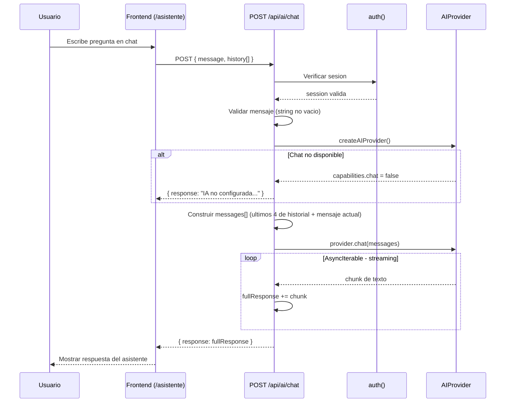

---

## 7. Maquina de Estados de Actividades

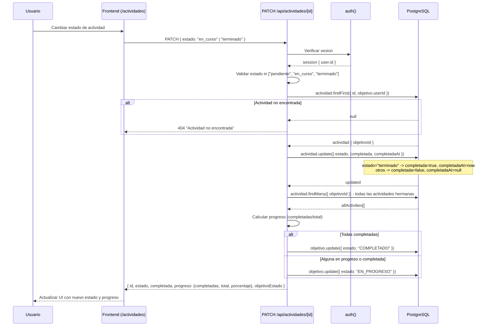

---

## 8. Actualizacion de KPI con Semaforo

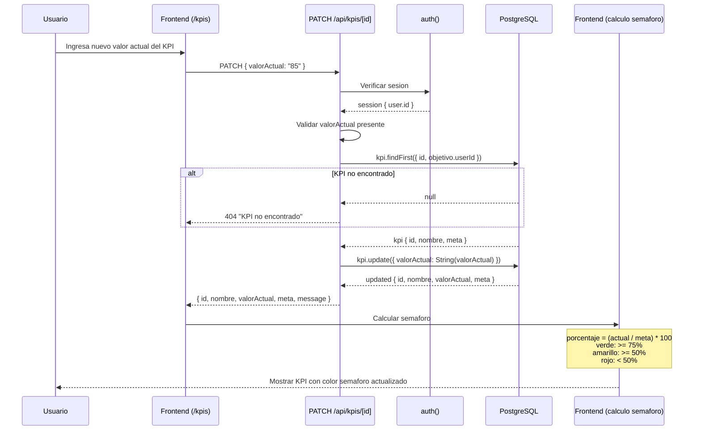

---

## 9. Vista Gerente (Dashboard Administrativo)

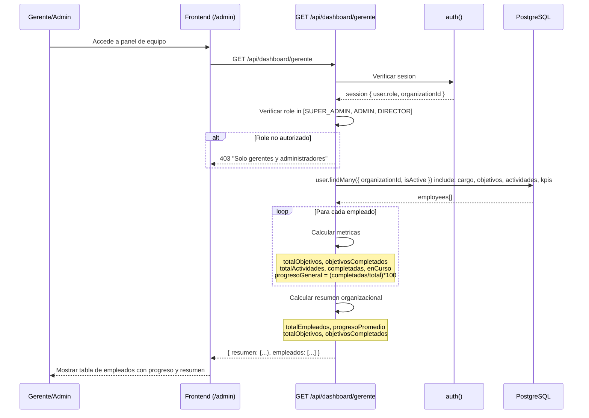

---

## 10. Comparativa Multi-Gestion (Year-over-Year)

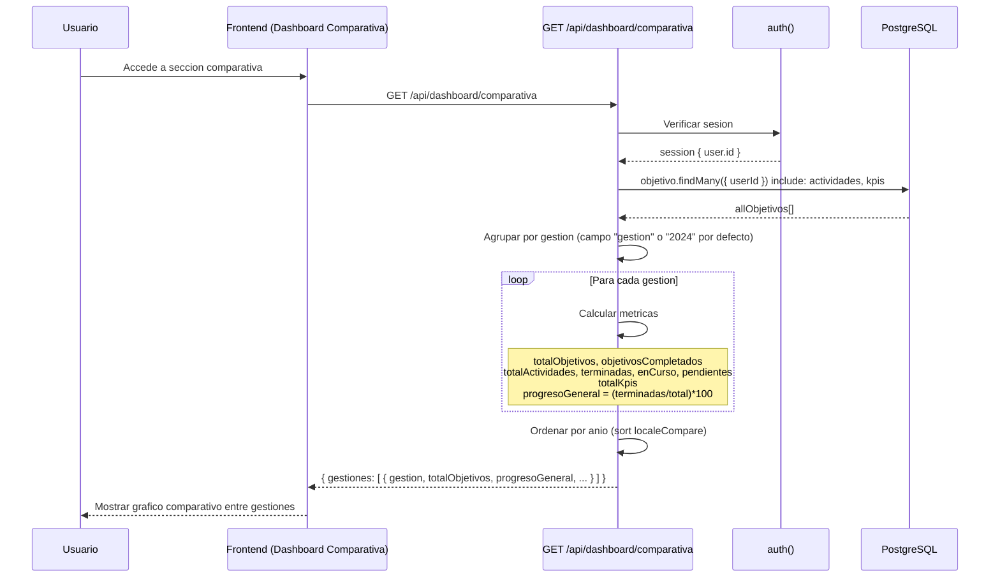

---

## 11. Generacion de Reportes

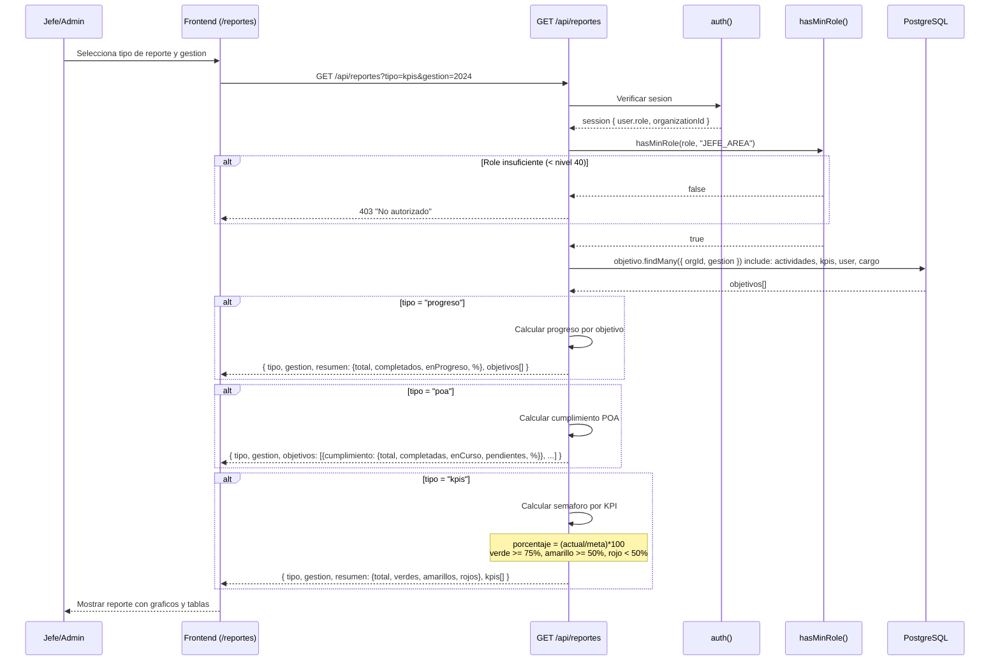

---

## 12. Configuracion 2FA (TOTP)

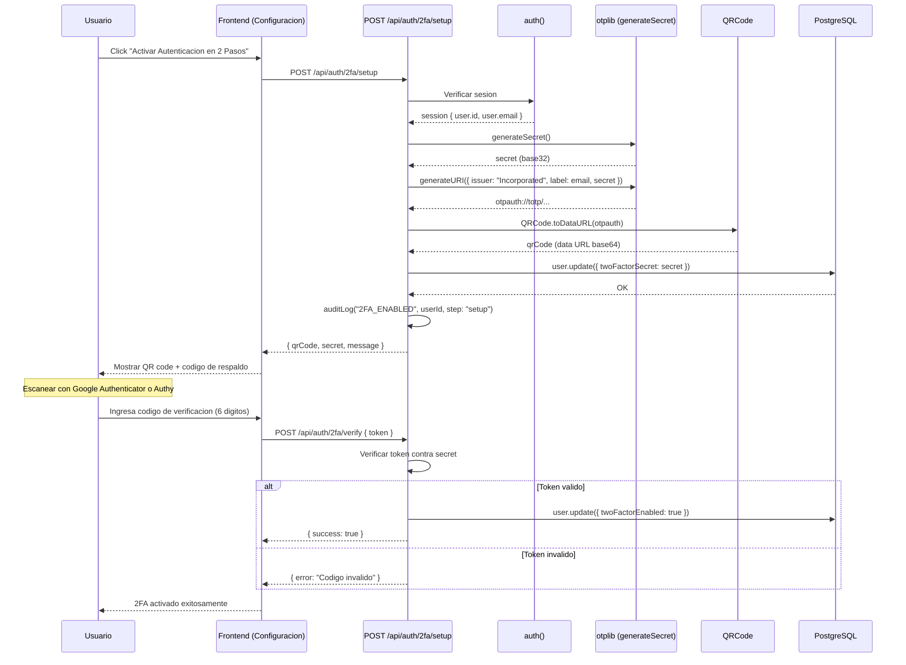

---

## 13. Middleware de Autenticacion

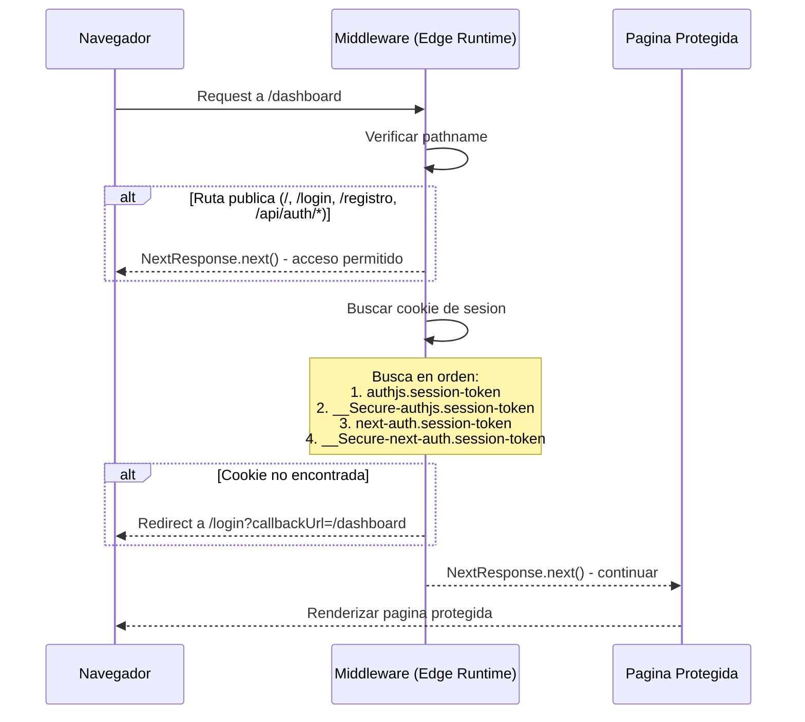

---

## 14. Flujo Completo: Construir Lineamientos (Vista Unificada)

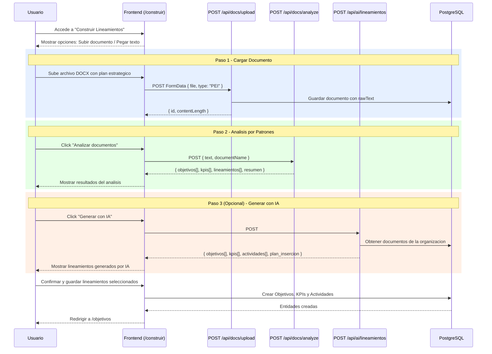
